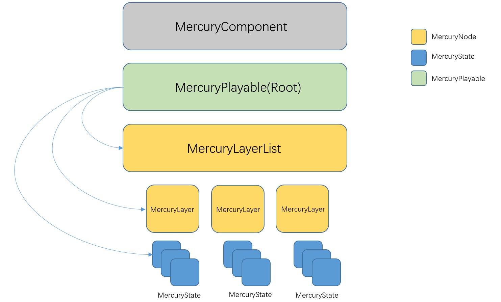

# Mercury
### Introduction
An Animation system for Unity based on Playable API
### Structure

**MercuryComponent**: Provide interfaces for developers, the essential functions are implemented in MercuryPlayable

Interfaces:
```c#
MercuryState Play(AnimationClip clip,float fadeDuration,FadeMode mode);
MercuryState Play(IParam param,float fadeDuration,FadeMode mode);
MercuryLayer GetLayer(int layerIndex);
MercuryLayer AddLayer();
```
Different parameters correspond to different states, and this system can easily insert custom animation states and switch between different states through blending.

Current Implemented state types:
- Clip State: Play single clip animation
- Blend State: Blend between 2 animations, controlled by a float parameter

### Features
Current Implemented Features:
- Animaion Load, Delete, Animation State Creation and Play
- Animation Blend, State Blend
- Animation Layer Blend, Layer Mask
- Architecture suitable for custom animation states

TODO:
- Motion Matching State
- Layer IK
- Performance Improvement
- Serializable Parameters(Scriptable Object?)

### Development Log
2024-6-13 v1.0